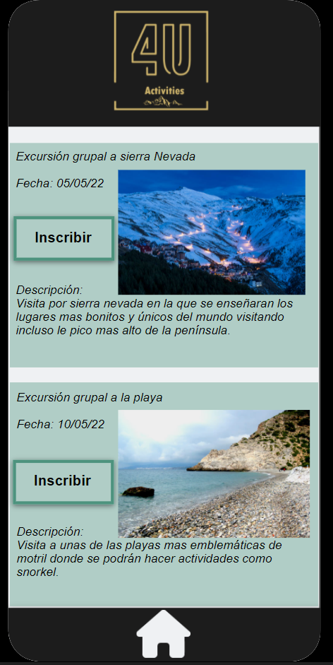

# DIU22
Prácticas Diseño Interfaces de Usuario 2021-22 (Tema: Hostels) 

Grupo: DIU1_01AABB.  Curso: 2021/22 
Updated: 11/2/2022

Proyecto: 
>>> Hostel 4U Activities

Descripción: 

>>> Crear nuevas actividades para los usuarios a realizar algunas dentro  del hostel y otras fuera. Además de informar a los usuarios de estas actividades permitiéndoles ver cuando se organizan estas para permitirles saber cuándo deberían acudir al hostel para participar en ellas. Implementar un sistema de valoraciones para los clientes en el que puedan dejar su valoración con texto y un nivel de puntuación del 1 al 5 con estrellas, además los demás clientes puedan decir si esa valoración les resultó útil o no.

Logotipo: 

 

Miembros
 * :bust_in_silhouette:   Alberto Martos Vela     :octocat:     
 * :bust_in_silhouette:  Manuel Reina Alonso     :octocat:

----- 

# Proceso de Diseño 

## Paso 1. UX Desk Research & Analisis 

1.a Competitive Analysis

 
-----

>>> Hostel 4U: página web de Hostel 4U, que se encuentra en el casco antiguo de Granada. El Hostel es una antigua casa patio del siglo XVI que ha sido restaurada. Encontramos  información acerca del alojamiento y habitaciones y podemos observar que también se define como restaurante y cocktail bar en el que poder desconectar y tomar algo.

>>> Hostel Paralelo Barcelona: página web del Hostel Paralelo situado en pleno Barcelona, muy cercano a lugares emblemáticos como La Rambla, Montjuic y el paseo marítimo. Encontramos información acerca de las instalaciones y facilidades como taquillas, w-fi gratis, etc. así como varias maneras de contactar con ellos y todo ello a través de una interfaz peculiar formada por botones pulsables de gran tamaño para ir a las diferentes áreas de la página.

>>> Cats Hostel Madrid Sol: página web de Cats Hostel Madrid Sol, situado en pleno centro de Madrid. Encontramos información acerca de los tipos de habitaciones así como de los diferentes espacios de los que dispone, siendo destacado su chill-out de día/club de noche: 
La Cueva. Además encontramos un pequeño apartado, si bajamos en la página, donde se nos indica cómo llegar al Hostel de diferentes formas.

>>> Tras realizar la comparación con otros hostel de distintas partes de España observamos que hostel4u es uno de los que menos opciones y facilidades nos prestan. A nuestro hostel le falta la implementación de poder pagar en varias monedas como tienen los otros dos que hemos comparado además vemos que hay otros con mayores opciones en cuanto al número de idiomas. Los otros dos tienen una mejor distribución de la información más intuitiva y fácil de llegar. En general las otras dos páginas son más completas ofreciendo más actividades sociales a realizar y teniendo una mayor accesibilidad a la hora de informar al usuario de las cualidades y las acciones a realizar en el hostel.

1.b Hugo

 
-----

>>>  La primera persona creada se llama Hugo y se trata de un chico joven de 30 años que reside en Madrid. Posee conocimientos medios en TIC, buen nivel de inglés y en un futuro le gustaría tener más tiempo libre para conocer nuevas amistades, aprender a esquiar y viajar para visitar distintas playas con su pareja. En un futuro no muy lejano le gustaría encontrar un trabajo donde poder teletrabajar y tener más tiempo libre.

1.b Marvin

 
-----

>>>  La segunda persona creada es Marvin Brooks un joven apasionado y extrovertido nacido en Londres que actualmente vive en Lyon,Francia.Trabaja como profesor particular y su estado civil es soltero. Se encuentra buscando experiencias nuevas como practicar nuevos deportes y conocer gente con la que compartir aficiones.

1.c User Journey Map Hugo

 
----

>>> Hugo desea hacer un viaje con su pareja y amigos en las vacaciones de verano. Deciden finalmente ir a un Hostel de Granada porque les gustaría visitar sus playas. Encuentran fácilmente que pueden seleccionar habitaciones para hasta 3 y más personas, por lo que deciden reservar dos habitaciones. Sin embargo, tienen un problema de falta de información acerca de algún parking en el que dejar el coche y también acerca de las actividades que se realizan en el Hostel. Deciden ponerse en contacto para aclarar sus dudas y acaban finalizando la reserva, estando todos firmes y contentos con la elección.

1.c User Journey Map Marvin

 
----

>>> Marvin está deseando hacer un viaje él solo, para practicar deporte y conocer gente nueva. Para ello comienza buscando un fecha que esté libre y le convenza el tiempo que hará.comienza por decidir el destino y escoge granda por el clima y la variedad de actividades pero a la hora de elegir el hostel le cuesta aunque por precio se acaba decidiendo por hostel4u. Cuando mira las actividades sociales en la página web se encuentra que apenas tiene actividades pero aun así decide seguir adelante. Tras eso busca de qué forma podría llegar al hostel y encuentra un autobús hasta la ciudad y después decide coger un uber hasta el hostel. Más tarde acaba reservando eligiendo la opción más barata.

 
 
 
 

 1.d Usability Review
----
>>> Excel en la carpeta P1/Usability-review.xlsx

>>> La puntuación final es: 73 (Good).

>>> Conclusión: Tras la reseña de usabilidad realizada evaluando los distintos puntos, la puntuación que ha obtenido la página ha sido de 73 esta nos indica que la usabilidad de la página es correcta pero mejorable. La información y las acciones que podemos realizar dentro de la página son claras e intuitivas aportando facilidades al usuario. Para mejorarla se podrían mejorar los errores que tiene a la hora de mostrar algunas fotos,  Implementar una barra de búsqueda, poner el mapa en una posición intuitiva. El mayor problema de la página web se encuentra en que son dos páginas web asociadas que a la hora de reservar te abre otra donde también se puede consultar la información del hostel lo cual hace que la experiencia de usuario no sea muy buena debido a que le genera un sensación de incertidumbre.

## Paso 2. UX Design  

2.a Feedback Capture Grid / EMpathy map / POV

 
----

    
>>> ¿Que planteas como "propuesta de valor" para un nuevo diseño de aplicación para economia colaborativa ?
>>> Problema e hipótesis
>>>  Que planteas como "propuesta de valor" para un nuevo diseño de aplicación para economia colaborativa te
>>> (150-200 caracteres)

 2.b ScopeCanvas

----
>>> Crear nuevas actividades para los usuarios a realizar algunas dentro del hostel y otras
fuera. Además de informar a los usuarios de estas actividades permitiéndoles ver cuando se
organizan estas para permitirles saber cuándo deberían acudir al hostel para participar en
ellas. Implementar un sistema de valoraciones para los clientes en el que puedan dejar su
valoración con texto y un nivel de puntuación del 1 al 5 con estrellas, además los demás
clientes puedan decir si esa valoración les resultó útil o no.

2.b Tasks analysis 

 
-----

>>> Definir "User Map" y "Task Flow" ... 

 2.c IA: Sitemap + Labelling 
 
 

----

>>> Identificar términos para diálogo con usuario  

Término | Significado     
| ------------- | -------
  Login¿?  | acceder a plataforma

2.d Wireframes

 

 
-----

>>> Plantear el  diseño del layout para Web/movil (organización y simulación ) 

## Paso 3. Mi UX-Case Study (diseño)

3.a Moodboard

 

-----

>>> Esta es nuestra Landing page, es decir, la página promocional del proyecto, donde podemos ver en grande nuestro eslogan que deja clara la intención de este, además de una breve descripción de lo que podrán encontrar los clientes y ciertas imágenes descriptivas apoyando nuestra intención de mostrar los distintos tipos de actividades que podrán encontrar.

 3.b Landing Page

 
----

>>> Esta es nuestra Landing page, es decir, la página promocional del proyecto, donde podemos ver en grande nuestro eslogan que deja clara la intención de este, además de una breve descripción de lo que podrán encontrar los clientes  y ciertas imágenes descriptivas apoyando nuestra intención de mostrar los distintos tipos de actividades que podrán encontrar.

3.c Guidelines

Logo

 
----

>>>Para la realización del logo nos basamos en el original para no romper con el estilo de la página principal por ello lo cambiamos para que representase las actividades al aire libre que queríamos mostrar en nuestra propuesta de valor. El cambio consistió en añadir una montaña del mismo color debajo y un nuevo título para representar las actividades al aire libre. Usamos la herramienta GIMP y una resolución de 644x495.

Paleta de colores

 
----

>>>Los colores que hemos elegido son una mezcla de los que ya había en la página original y dos más que hemos añadido.
Los colores negro y dorado son para mantener el estilo de la pagina original para ello nos hemos decantado por los dos mas representativos y que componen el logo.
Los colores blanco y verde los hemos incluido para darle una imagen más fresca que a su vez refleje paz para de esta forma presentar las actividades al aire libre en consonancia.

Iconografía

 
----

>>>Los iconos los hemos seleccionado de la página ionicons escogiendo el estilo Regular ya que creemos que es el que mejor se adapta a nuestra página por el diseño de fácil visibilidad que nos aporta. Aquí vemos algunos ejemplos de los iconos que hemos escogido:

Tipografías

>>> Hemos seleccionado tres fuentes distintas, Arial, Britannic Bold y Tw Cen MT Condensed Extra Bold. Las dos primeras mencionadas las usaremos para todo el contenido en general de la página, mientras que la tercera será usada únicamente en el logo de la misma. Pensamos que son fuentes sencillas, legibles y agradables a la vista, además de funcionar bien con el diseño que deseábamos darle a nuestra página.

Patrones de diseño

>>>En cuanto a los patrones de diseño hemos decidido usar para el prototipado la herramienta ProtoPie, que es una herramienta que nos permite aplicar el diseño deseado de forma cómoda y provee de diversas herramientas, formatos, iconos, etc. para hacer la aplicación sencilla y legible para todo tipo de usuarios, aunque no estén acostumbrados a usar este tipo de aplicaciones.
Hemos usado unos patrones muy sencillos para permitir que el uso de la aplicación sea lo más intuitivo posible para el usuario. Se ha utilizado una distribución simétrica y hacia abajo de la información a mostrar, separando claramente la parte de las actividades, de las valoraciones de los usuarios sobre estas y el Hostel. También hemos hecho uso de un patrón de valoraciones con estrellas para su uso por parte del cliente. Además hemos añadido en la barra de abajo un icono muy intuitivo de una casa, que como se puede intuir, llevará al usuario a la pantalla de inicio. Por último, cabe destacar el patrón de transiciones entre distintas pantallas, puesto que si se accede a algo se produce una transición de derecha a izquierda y si volvemos hacia atrás ocurre al revés.

 3.d Mockup

 
----

 
----

 
----

 
----

>>> Para acceder al prototipo interactivo se puede acceder mediante este link: https://cloud.protopie.io/p/27c0188b0a 

3.e ¿My UX-Case Study?

>>> Para publicar el caso de estudio hemos usado github para publicarlo de manera sencilla y accesible.

## Paso 4. Evaluación 

 4.a Caso asignado
----

>>> Como asignación para el caso B, en primera instancia se nos asignó el grupo 11, pero al no tener enlace al github, ni ningún reporte acerca de su práctica, finalmente nos fue asignado el grupo 12 llamado DoubleAI,  cuyo enlace es:

https://github.com/adelatorresaavedra/DIU

 4.b User Testing
----

>>>En este apartado vamos a proceder a la creación de cuatro perfiles diferentes de personas que podrían interactuar con nuestra web y la de los compañeros. Es importante que no sean demasiado similares pues así podremos observar mejor cómo varía su ‘SUS score’ dependiendo de su ocupación, su perfil y sobre todo de su experiencia en internet y las distintas plataformas que suelen usar.
 

 

. 4.c Cuestionario SUS
----

>>> Usaremos el **Cuestionario SUS** para valorar la satisfacción de cada usuario con el diseño (A/B) realizado. Para ello usamos la [hoja de cálculo](https://github.com/albertomv00/DIU/blob/master/P4/Cuestionario_SUS.xlsx) para calcular resultados sigiendo las pautas para usar la escala SUS e interpretar los resultados

>>> Viendo los resultados podemos ver resultados similares en cuanto términos de usabilidad, las diferencias las observamos en los distintos perfiles ya que al tener distinta experiencia usando nuevas tecnologías vemos dificultades en  los usuarios con un nivel más bajo y mayor facilidad en los usuarios con mayor experiencia. Es por esto que a pesar de que la puntuación de A es mayor podemos decir que son muy similares debido a que sus usuarios tienen distinto nivel de experiencia TIC.

 4.d Usability Report
----

>> [Report usabilidad](https://github.com/albertomv00/DIU/blob/master/P4/Usability.pdf)

>>> Conclusión
La web cumple con su objetivo de presentar las distintas actividades que podemos realizar en Granada. Es un prototipo con un diseño legible, claro y bastante intuitivo, sobre todo para personas con una experiencia en internet media/alta, aunque es cierto, que personas con pocos conocimientos en internet pueden perderse en la búsqueda de cierta información. Posee un diseño llamativo y bien estructurado, por eso ronda el 80 de puntuación, ya que la mayoría de funcionalidades están implementadas, aunque sí hay ciertas que aún no lo están por lo que podemos decir que no termina de ser un prototipo final.
Como puntos a mejorar se podría aportar un feedback de en qué página nos encontramos ya que si estamos en el home y le damos al botón home no hace nada podría actualizarse la página haciendo ver que nos encontramos en el home. También se podría ampliar el rango de clic de los botones para mejorar la navegabilidad de la página ya que a veces si el rango donde funciona el clic es muy reducido puede empeorar la sensación del usuario.

